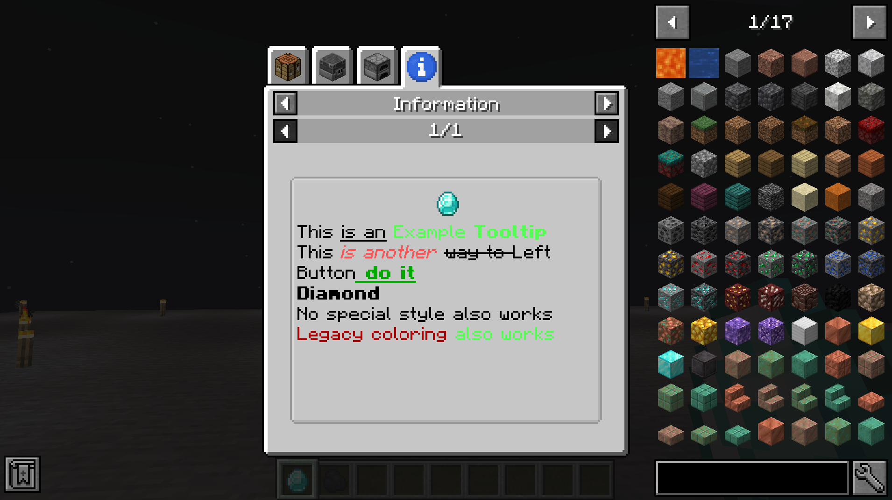

# InfoDataPack
[](https://github.com/GoryMoon/InfoDataPack/actions/workflows/ci.yml)

[](https://www.curseforge.com/minecraft/mc-mods/infodatapack)
[](https://www.curseforge.com/minecraft/mc-mods/infodatapack)

[](https://modrinth.com/mod/infodatapack)
[](https://modrinth.com/mod/infodatapack)

A mod to add tooltip and jei information to items with a datapack

## Usage
You can find examples below, the same examples are available in the `example_datapack` folder.
NBT filtering only works for tooltips, in JEI the item only uses that data to show. 

The json text can for example be generated with the help of [minecraftjson.com](https://minecraftjson.com) or [minecraft.tools](https://minecraft.tools/en/json_text.php)

The SNBT part of the item can be written/edited with [SNBT Editor](https://gorymoon.github.io/snbt-editor/)

### Tooltip

For tooltips you can add a `exclude_nbt`, it will exclude any item matching that nbt. It can be combined with the normal `nbt`.

```json
{
    "items": [
        "minecraft:diamond",
        {
            "item": "minecraft:coal",
            "nbt": {
                "display": {
                    "Name": "{\"text\":\"Compact Coal\"}"
                }
            },
            "exclude_nbt": {
                "display": {
                    "Name": "{text:\"Infinity Diamond\"}"
                }
            }
        }
    ],
    "tooltips": [
        {"text":"This ", "extra": [{"text":"is an","underlined":true},{"text":" Example ","color":"green"},{"text":"Tooltip","bold":true,"color":"green"}]},
        ["",{"text":"This "},{"text":"is another ","italic":true,"color":"red"},{"text":"way to ","strikethrough":true},{"keybind":"key.attack"},{"text":" do it","bold":true,"underlined":true,"color":"dark_green"}],
        {"translate":"item.minecraft.diamond","bold":true},
        "No special style also works",
        "§4Legacy coloring §aalso works"
    ]
}
```

### JEI

```json
{
    "items": [
        "minecraft:diamond",
        {
            "item": "minecraft:coal",
            "nbt": {
                "display": {
                    "Name": "{\"text\":\"Compact Coal\"}"
                }
            }
        }
    ],
    "infos": [
        {"text":"This ", "extra": [{"text":"is an","underlined":true},{"text":" Example ","color":"green"},{"text":"Tooltip","bold":true,"color":"green"}]},
        ["",{"text":"This "},{"text":"is another ","italic":true,"color":"red"},{"text":"way to ","strikethrough":true},{"keybind":"key.attack"},{"text":" do it","bold":true,"underlined":true,"color":"dark_green"}],
        {"translate":"item.minecraft.diamond","bold":true},
        "No special style also works",
        "§4Legacy coloring §aalso works"
    ]
}
```
